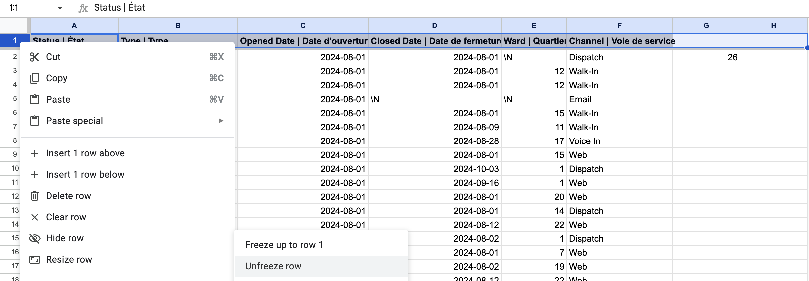
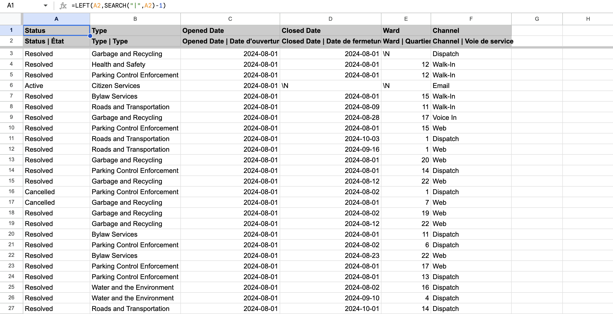
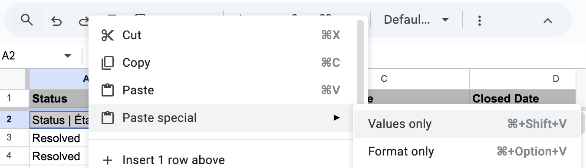
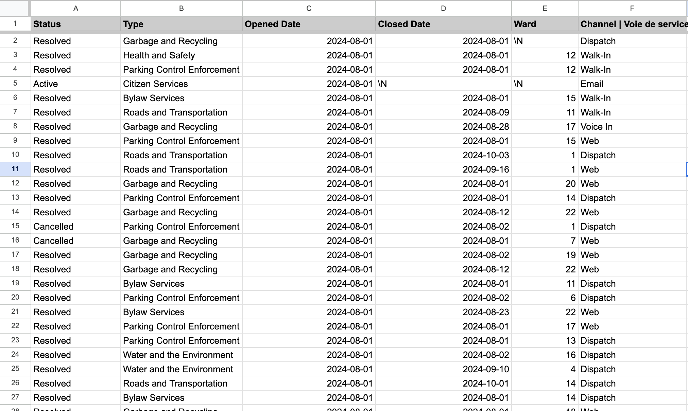
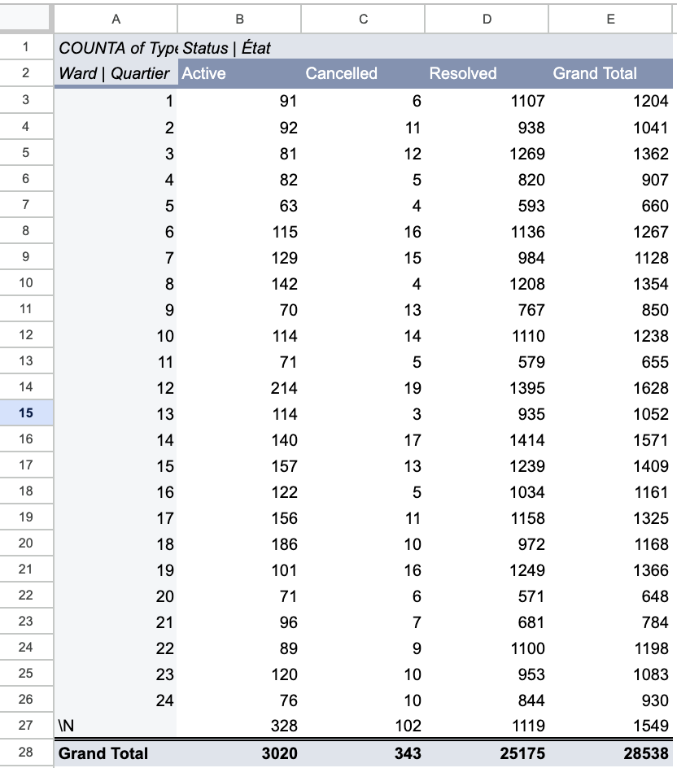
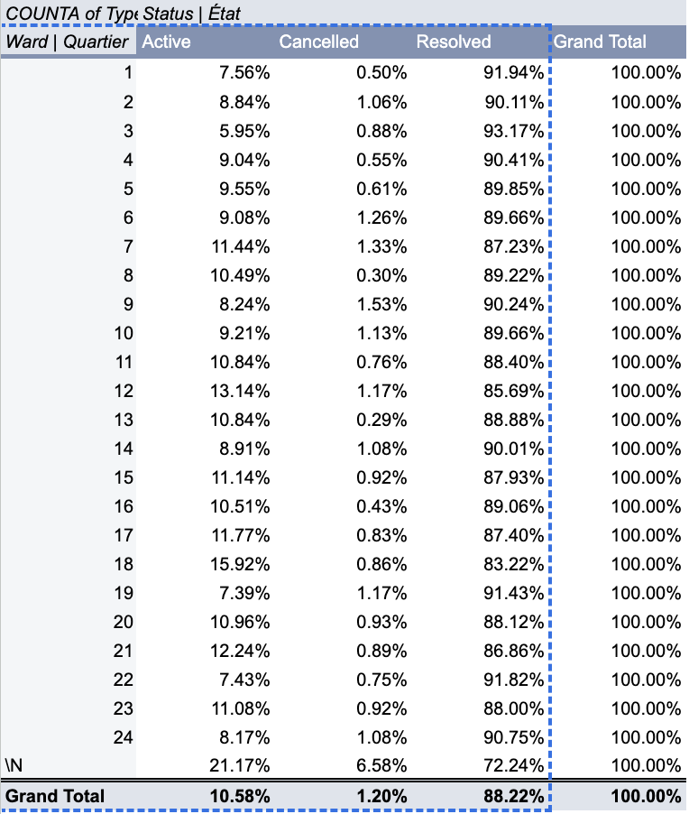

**Thursday November 7th 2024**<br>
**MPAD 2003A Data Storytelling**<br>
**Morgan Paine**<br>
**Presented to Jean-Sébastien Marier**<br>

# Midterm Project: Exploratory Data Analysis (EDA)


## Foreword

**Here are some useful resources for this assignment:**

* [GitHub's *Basic writing and formatting syntax* page](https://docs.github.com/en/get-started/writing-on-github/getting-started-with-writing-and-formatting-on-github/basic-writing-and-formatting-syntax)
* [The template repository for this assignment in case you delete something by mistake](https://github.com/jsmarier/jou4100_jou4500_mpad2003_project2_template)

Did you notice how to create a hyperlink? In Markdown, we put the clickable text between square brackets and the actual URL between parentheses.


## 1. Introduction

For this assignment, I am tasked with performing an Exploratory Data Analysis on a condensed version of a dataset titled "2024 Service Requests" from The City of Ottawa's Website. 
I will be focusing on the month of August. 
The method of obtaining the data is as follows: 
- 311 Contact Centre
- Client Service Centre
- 311 Email
- Web-Based Self Service Portal

Regarding how the data is presented, it is on a spreadsheet that holds columns for each section of a service request:
- Service Request ID Number
- Status
- Desc. of Request
- Type
- Opened Date
- Closed Date (if applicable)
- Address
- Longitude
- Latitude
- Ward #
- Channel (that request came from)


Throughout this assignment I will walk through my process of completing an exploratory data analysis while going through the following:

- Getting Data 
- VIMO Analysis
- Cleaning Data
- EDA (Exploratory Data Analysis)
- Potential Story
- Conclusion
- References

Links to the datasets can be found:


## 2. Getting Data

To import this dataset into Google Sheets, I first began by downloading it to my desktop and importing the data into a blank sheet. To do this, I first opened the file provided, I then downloaded this file to my "Downloads" folder. Following this, I opened a new spreadsheet on Google Sheets and clicked "File" then "Import". I then went to the "Upload" subhead and I was able to insert this file. For import location, I had "Replace spreadsheet", and for separator type I had "Comma" because the file type is .csv (comma separated values).
Now: This is what my spreadsheet looks like right after importation:
<br>
*Figure 1: This shows what my dataset looks like directly after importation.*

There are 11 columns and 28536 rows. The data itself does not look clean and the spreadsheet is essentially unreadable. For example, the top row, holding the headings disappears as you scroll down, data is unaligned within their columns adding to the unreadability. Another example is the lack of whitespace in the columns which is cutting off the text in the cells. The spreadsheet also holds columns that are mainly empty and unuseful minus a few values (longitude, latitude). 


Making more specific observations, I noticed that column “B” is made up of nominal values, showing if a service request has been resolved, cancelled, or active. I also noticed columns “E”and “F”  consist of ordinal variables. They show the date that requests were opened and closed (if applicable). Also, column “J” is made up of nominal variables, showing ward numbers that these requests were made in. 


A question I would love to ask is: Which ward holds the most active service requests, and why? What are the factors that could play into this? 
Many things could come into play here, such as budget issues, certain types of requests, etc.


**Here are examples of functions and lines of code put in grey boxes:**

1. If you name a function, put it between "angled" quotation marks like this: `IMPORTHTML`.
1. If you want to include the entire line of code, do the same thing, albeit with your entire code: `=IMPORTHTML("https://en.wikipedia.org/wiki/China"; "table", 5)`.
1. Alternatively, you can put your code in an independent box using the template below:

``` r
=IMPORTHTML("https://en.wikipedia.org/wiki/China"; "table", 5)
```


## 3. Understanding Data

### 3.1. VIMO Analysis


VIMO analysis is a great tool for further understanding of any given dataset. The acronym stands for: Valid, Invalid, Missing, Outliers.

Valid:
The columns "Status" and "Channel" contain valid, consistent values. "Status" has only "Resolved," "Active," and "Cancelled,". "Channel" column has valid categories like "Dispatch," "Walk-In," etc.
Overall, most values seem valid.
Invalid:
Using a pivot table, I found that there are 2 \N values in the “Type” column. This is odd as every other value seems to be placed in a specific type. This value can be seen as missing or invalid. 
Missing:
There are 3,020 missing values in the "Closed_Date" column and 1,549 in the "Ward" column. These might indicate unresolved cases or cases without specific ward data, so we could flag or remove them depending on their relevance. 
Outliers:
I was unable to find any outliers in this dataset. 

I find this dataset to be generally reliable, considering where it came from, and also the high percentage of valod values. Many large datsets like this one can become unreliable, fast. I find this datset was able to stay generally oraganized. 

### 3.2. Cleaning Data

To begin, I froze the first row of the dataset in order to assert that it shows the titles of the data shown below. I also bolded the text of this row and added a dark grey background to make it more distinct and readable.
<br>
*Figure 2: Showing path to successfully freezing a row.*

I also deleted four columns that are not required for my data analysis (longitude, latitude, address, service request number). 

I added white space in between all of the columns by double clicking the square in the top left corner of the dataset in order to view all of the text. 

In order to remove the french side of the description in the top row, I did some reseach. The `SPLIT` fuction could have worked in this case, but I figured it would not be the best method. After looking up a solution, I came across the [Geeks for Geeks Wesbite](https://www.geeksforgeeks.org/how-to-remove-text-before-or-after-a-specific-character-in-excel/). 
This introduced a few equations for me, but the one I ended up using was the `LEFT` function. Essentially, this function searches for a given charcter in a given cell, then procedes to remove everything to the left of it including the character. Below I have included an image of the row I added to implement the equation, and the equation without the `LEFT` function applied.
<br>
*Figure 3: Rows A and B before and after LEFT function.*

The equation I used is as follows:
``` r
=LEFT(A2,SEARCH("|",A2)-1)
```
After this I had to delete the row with the english and french descriptions.
To do this I had to copy the row with the results and and paste as special values. This will paste the result without causing an error when I delete the cells needed to equate the result.
<br>
*Figure 4: Pasting results as special values*


This image below shows my dataset after the cleaning process.
<br>
*Figure 5: Dataset After Cleaning*


### 3.3. Exploratory Data Analysis (EDA)

For the exploratory data analysis, I began by creating a pivot table with the following settings: rows- ward ascending, columns -Status ascending, and values - type COUNTA. This was able to show me the amount of service request per ward listed into active, cancelled, and resolved. 
I chose those variables because I was interested in seeing the contrast between wards and exploring the difference in complete requests. 
This chart can be shown below:
<br>
I noticed that while this shows me exact data of what I was looking for, I wanted a version that was easier to understand, making understanding the data quicker and more accessible. That’s when I thought of using % instead of default in the ‘show as’ section. Once I changed this to ‘% of row’ I was much happier with the table as I was able to really see who was leading in resolved service requests as a percentage, rather than a value, which is a much better comparison for this data story. See the new chart below:
<br>
For the chart, this is where I found myself struggling. I wanted to make something that was a clear representation of the variance of incomplete requests per ward. The axis is where the problem lies. If I were to include all three series (Complete, Ongoing, Cancelled) the product would look completely unreadable with the “Complete” category taking up the majority of space. 


While viewing both the dataset and the chart, I noticed that while there are no extreme outliers, there are differences between wards that should be noted. 
The highest active comes from ward-less request at 21.17%, and the lowest incomplete comes from Ward 3 at 5.95%. Realizing that the ward-less requests being the highest may make sense considering they may be much larger issues that need inter-city collaboration. Ward 3's percentage is very low considering the average active cases per ward, in percentages, is: 10.44%
The equation I used to find this can be found here:

``` r
=AVERAGE(B3:B28)
```

As I stated earlier, while there are no outright outliers, I find it an important area to cover as that 20% matters to people in our communities. 


**This section should also include a screen capture of your exploratory chart, like so:**


## 4. Potential Story

Insert text here.

## 5. Conclusion

Insert text here.

## 6. References

Include a list of your references here. Please follow [APA guidelines for references](https://apastyle.apa.org/style-grammar-guidelines/references). Hanging paragraphs aren't required though.

**Here's an example:**

Bounegru, L., & Gray, J. (Eds.). (2021). *The Data Journalism Handbook 2: Towards A Critical Data Practice*. Amsterdam University Press. [https://ocul-crl.primo.exlibrisgroup.com/permalink/01OCUL_CRL/hgdufh/alma991022890087305153](https://ocul-crl.primo.exlibrisgroup.com/permalink/01OCUL_CRL/hgdufh/alma991022890087305153)
