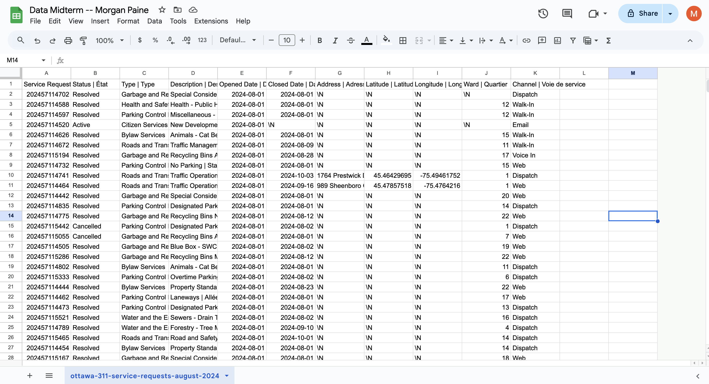

**Thursday November 7th 2024**<br>
**MPAD 2003A Data Storytelling**<br>
**Morgan Paine**<br>
**Presented to Jean-Sébastien Marier**<br>

# Midterm Project: Exploratory Data Analysis (EDA)

Use one hashtag symbol (`#`) to create a level 1 heading like this one.

## Foreword

For this assignment, you must extract data from a dataset provided by the instructor. You must then clean and analyze the data, create exploratory charts/visualizations, and find a potential story idea. Your assignment must clearly detail your process. You are expected to write about 1500-2000 words, and to include several screen captures showing the different steps you went through. Your assignment must be written with the Markdown format and submitted on GitHub Classroom.

I have been assigning different versions of this project to my digital journalism and data storytelling students for a few years now. Its structure was inspired by the main sections/chapters of [*The Data Journalism Handbook*](https://datajournalism.com/read/handbook/one/). This version was further inspired by the [Key Capabilities in Data Science](https://extendedlearning.ubc.ca/programs/key-capabilities-data-science) program offered by the University of British Columbia (UBC).

**Here are some useful resources for this assignment:**

* [GitHub's *Basic writing and formatting syntax* page](https://docs.github.com/en/get-started/writing-on-github/getting-started-with-writing-and-formatting-on-github/basic-writing-and-formatting-syntax)
* [The template repository for this assignment in case you delete something by mistake](https://github.com/jsmarier/jou4100_jou4500_mpad2003_project2_template)

Did you notice how to create a hyperlink? In Markdown, we put the clickable text between square brackets and the actual URL between parentheses.

And to create an unordered list, we simply put a star (`*`) before each item.

## 1. Introduction

For this assignment, I am tasked with performing an Exploratory Data Analysis on a condensed version of a dataset titled "2024 Service Requests" from The City of Ottawa's Website. 
I will be focusing on the month of August. 

## 2. Getting Data

To import this dataset into Google Sheets, I first began by downloading it to my desktop and importing the data into a blank sheet. To do this, I first opened the file provided, I then downloaded this file to my "Downloads" folder. Following this, I opened a new spreadsheet on Google Sheets and clicked "File" then "Import". I then went to the "Upload" subhead and I was able to insert this file. For import location, I had "Replace spreadsheet", and for separator type I had "Comma" because the file type is .csv (comma separated values).
Now: This is what my spreadsheet looks like right after importation:
<br>


There are 11 columns and 28536 rows. The data itself does not look clean and the spreadsheet is essentially unreadable. For example, the top row, holding the headings disappears as you scroll down, data is unaligned within their columns adding to the unreadability. Another example is the lack of whitespace in the columns which is cutting off the text in the cells. The spreadsheet also holds columns that are mainly empty and unuseful minus a few values (longitude, latitude). 


Making more specific observations, I noticed that column “B” is made up of nominal values, showing if a service request has been resolved, cancelled, or active. I also noticed columns “E”and “F”  consist of ordinal variables. They show the date that requests were opened and closed (if applicable). Also, column “J” is made up of nominal variables, showing ward numbers that these requests were made in. 


A question I would love to ask is: Which ward holds the most active service requests, and why? What are the factors that could play into this? 
Many things could come into play here, such as budget issues, certain types of requests, etc.


## heading!

To include a screen capture, use the sample code below. Your images should be saved in the same folder as your `.md` file.

<br>
*Figure 1: The "Import file" prompt on Google Sheets.*

**Here are examples of functions and lines of code put in grey boxes:**

1. If you name a function, put it between "angled" quotation marks like this: `IMPORTHTML`.
1. If you want to include the entire line of code, do the same thing, albeit with your entire code: `=IMPORTHTML("https://en.wikipedia.org/wiki/China"; "table", 5)`.
1. Alternatively, you can put your code in an independent box using the template below:

``` r
=IMPORTHTML("https://en.wikipedia.org/wiki/China"; "table", 5)
```
This also shows how to create an ordered list. Simply put `1.` before each item.

## 3. Understanding Data

### 3.1. VIMO Analysis

VIMO analysis is a great tool for futher understanding of any given dataset. The acronym stands for: Valid, Invalid, Missing, Outliers. 

Support your claims by citing relevant sources. Please follow [APA guidelines for in-text citations](https://apastyle.apa.org/style-grammar-guidelines/citations).

**For example:**

As Cairo (2016) argues, a data visualization should be truthful...

### 3.2. Cleaning Data

Insert text here.

### 3.3. Exploratory Data Analysis (EDA)

Insert text here.

**This section should include a screen capture of your pivot table, like so:**

<br>
*Figure 2: This pivot table shows...*

**This section should also include a screen capture of your exploratory chart, like so:**

<br>
*Figure 3: This exploratory chart shows...*

## 4. Potential Story

Insert text here.

## 5. Conclusion

Insert text here.

## 6. References

Include a list of your references here. Please follow [APA guidelines for references](https://apastyle.apa.org/style-grammar-guidelines/references). Hanging paragraphs aren't required though.

**Here's an example:**

Bounegru, L., & Gray, J. (Eds.). (2021). *The Data Journalism Handbook 2: Towards A Critical Data Practice*. Amsterdam University Press. [https://ocul-crl.primo.exlibrisgroup.com/permalink/01OCUL_CRL/hgdufh/alma991022890087305153](https://ocul-crl.primo.exlibrisgroup.com/permalink/01OCUL_CRL/hgdufh/alma991022890087305153)
